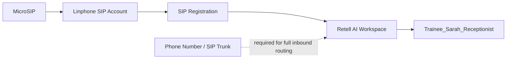

# 📞 Retell AI — Topic 7: Call Routing & SIP Trunks

<p align="center">
  
</p>

<p align="center">
  <b>SIP Softphone Registration • Retell AI Receptionist • Telephony Readiness</b>
</p>

<p align="center">
  <a href="https://www.loom.com/share/50499f2cbecd4ed196f78a10c25c813f"></a>
  <a href="./Topic_7_Call_Routing_SIP_Trunks_Assessment.pdf"></a>
  <a href="#evidence"></a>
</p>

---

## ✨ Project Overview

This repository documents the Topic 7 **Call Routing & SIP Trunks** implementation work completed around a Retell AI receptionist agent and a desktop SIP softphone.

### 🧩 Architecture



> **Status:** Softphone registration and Retell agent preparation are documented. Full Retell SIP trunk provisioning and inbound PSTN/SIP call testing remain blocked because a provider-issued phone number, termination URI and SIP credentials were not available.

---

## 🚀 What Was Completed

| Area | Status |
|---|---|
| MicroSIP desktop installation | ✅ Complete |
| SIP account configuration | ✅ Complete |
| SIP registration / Online status | ✅ Verified |
| Retell receptionist agent | ✅ Reviewed |
| Retell Phone Numbers workflow | ✅ Reviewed |
| SIP trunk import form | ✅ Reviewed |
| Real provider SIP trunk | ⚠️ Not available |
| Retell phone number | ⚠️ Not provisioned |
| Inbound PSTN/SIP test call | ⚠️ Not run |
| Telephony call logs | ⚠️ Not available |

---

## 🎯 Agent Configuration

**Agent:** `Trainee_Sarah_Receptionist`

**Purpose:** Friendly AI receptionist for inbound customer calls.

**Configured behavior:**
- Greet callers professionally
- Ask how the caller can be helped
- Collect name and callback number when needed
- Answer basic business-hours and service questions
- Avoid inventing information
- Keep replies concise and polite

---

## 📸 Evidence

### 01 — MicroSIP Online


### 02 — MicroSIP SIP Account


> 🔐 Password is intentionally not exposed.

### 03 — Retell Agent Configuration


### 04 — Retell Phone Numbers


### 05 — SIP Trunk Connection Form


---

## 🎥 Loom Demonstration

**Watch the walkthrough:** [Open Loom Demo](https://www.loom.com/share/50499f2cbecd4ed196f78a10c25c813f)

The demo covers:

1. MicroSIP Online registration
2. SIP account configuration
3. Retell receptionist agent
4. Phone Numbers workspace state
5. SIP trunk form requirements
6. Current implementation limitation

---

## 📄 Assessment

[**Download / View Topic 7 Assessment PDF →**](./Topic_7_Call_Routing_SIP_Trunks_Assessment.pdf)

---

## 🔒 Security

Never commit:
- SIP passwords
- API keys
- Authentication tokens
- Private provider credentials

Use masked screenshots for credentials and keep secrets outside the repository.

---

## 🧪 Final Validation State

```
SIP Account Registration     ✅
MicroSIP Online              ✅
Retell Agent Prepared        ✅
Retell Phone Number          ❌ Not provisioned
SIP Trunk                    ❌ Provider credentials unavailable
Inbound Test Call            ❌ Not performed
```

---

<p align="center">
  <b>Built as part of the Orion LMS — Tayana Academy learning project.</b>
</p>
